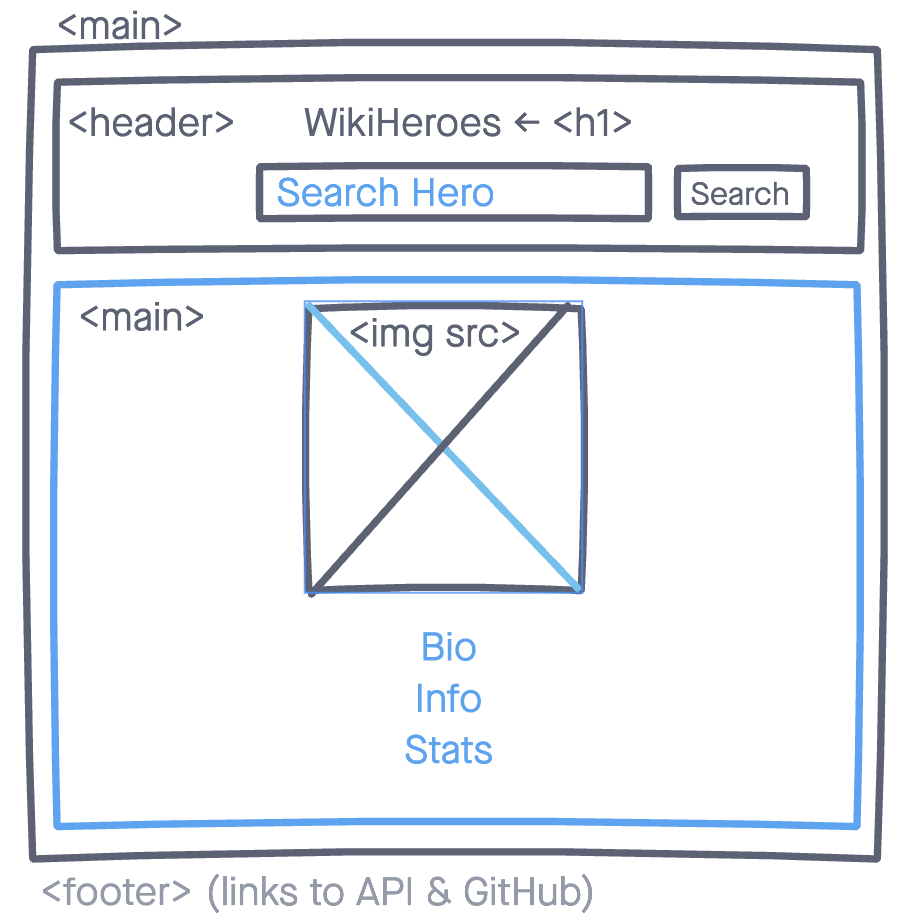

# WIki Heros Project

## Hello and welcome to my first webpage!
For my first webpage I am going to create a wiki for Superheros in universes including Marvel, DC Comics, and even Dragon Ball. Through a simple search of a hero's name the webpage should provide you with basic information, the abilities and even apperance. 

## Technologies Used: 
For my webpage, I used: 
- HTML
- Javascript 
- CSS for styling - jQuery 
- Coding was done on Virtual Studio Code application on a Macbook Air M1. 

## Screenshots: 

 ## Get Started!: 

[Link to my Project](https://hero-project1.vercel.app/)

## Future Enhancements: 

 For Future Enhancements: 
- I'd like to add an autocomplete to the input field. 
- I'd like to fix the code to access multiple objects from the API.
- Add a header meanu with Home, About and Favorites page where the user can add or click a star to their favoritie heros and store them in the site. Once you visit the Favorites page you see all of your starred heros. 
