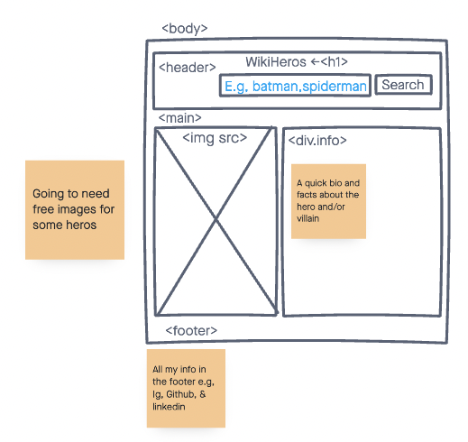
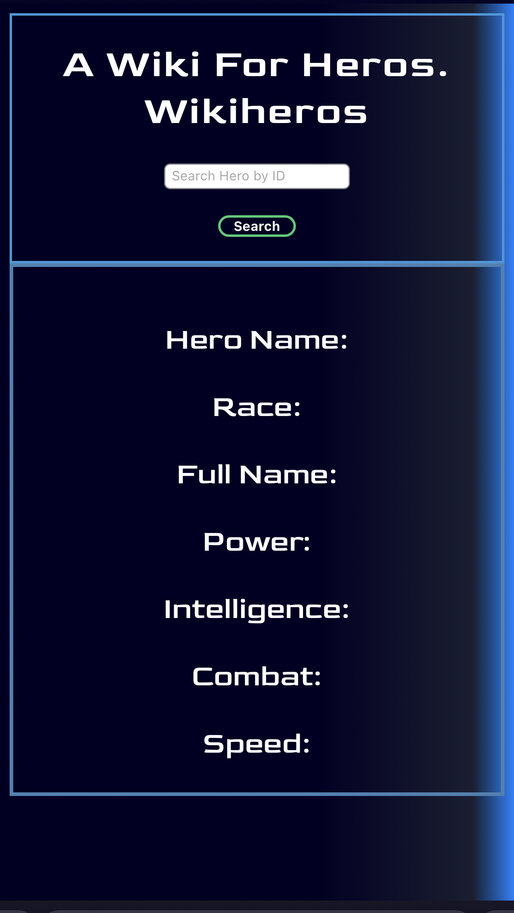

# WIki Heros Project

## Hello and welcome to my first webpage!
For my first webpage I am going to create a wiki for Superheros in universes including Marvel, DC Comics, and even Dragon Ball. Through a simple search of a hero's name the webpage should provide you with basic information, the abilities and even apperance. 

## Technologies Used: 
For my webpage, I used: 
- HTML
- Javascript 
- CSS for styling - jQuery 
- Coding was done on Virtual Studio Code application on a Macbook Air M1. 

## Screenshots: 

 <!-- ## Get Started!:  -->